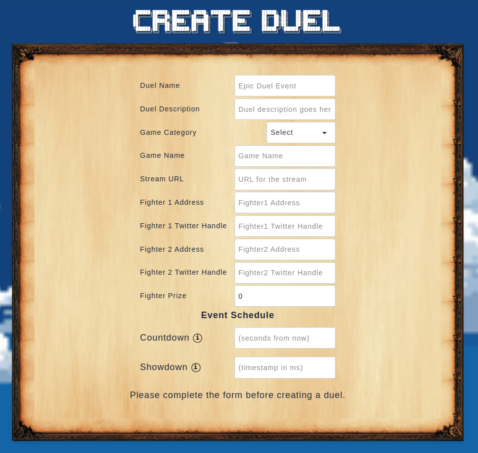
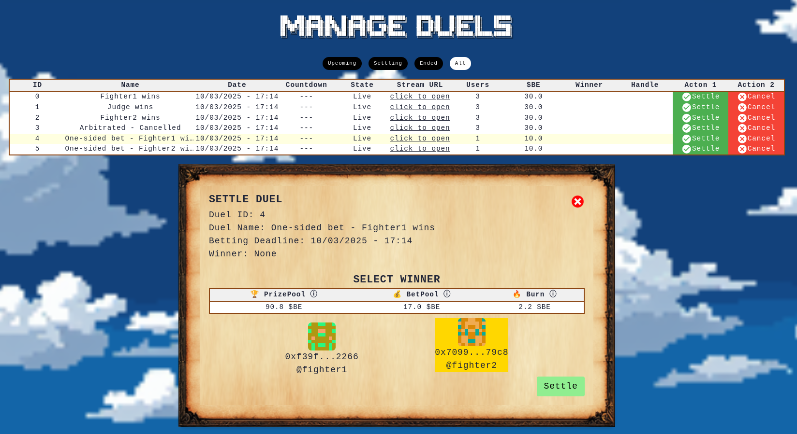

# Hosting

Schedule your duel, begin the broadcast, submit a winner.

As a host you are able to easily organize duels by using the platform.

You are also responsible for making sure all participants show up on time and that the game has a clear winner. Duels are settled optimistically, meaning that payments are completed in 48hrs unless your stream is disputed.

## Create Duels

To successfully host a duel, you'll require the following:

- **Basic Info**: The name of the event, game you'll be playing, and the description of the duel.
- **Register Stream**: Configure the URL for your Twitch channel. **Your duel must be visible during the 48hr period.**
- **Fighter Wallets**: Enter the fighter wallets to configure who will be participating. These wallets will be used to claim the prize.
- **Sponsor Event**: Choose an amount in $BE to sponsor the duel. The winner takes the prize. Winners also get 8% of the total bet pool.
- **Set Timeline**: Specify when your event will go live.
- **Clear Winner**: Make it clear who the winner is during your livestream, and submit the answer from the management panel.

Once you start your stream via Twitch or Youtube, your stream will automatically be broadcasted on DU3L73K.

## Settle Duels

At the end of every duel, you should record yourself settling the event live from your broadcast, by using the management panel. After you submit the winner, a 48hr dispute period begins.

## Disputes

As DU3L73K is still under development, we recommend that hosts organize duels between participants that will show up on time and play fair.

Here are some reasons why your duel may be cancelled or disputed:
- You or your opponent threw the game.
- You or your opponent used cheats or hacks.
- You failed to start the stream on time.
- Your opponent was unable to connect with you.
- Your opponent won but you gave yourself the victory.
- You failed to make sufficient effort to connect with your opponent.

DU3L73K is still under development and we are continually improving our duel and dispute mechanisms.

## Whitelist

Currently, only whitelisted participants can host events.

You can become a host by [registering here](https://form.typeform.com/to/ySIjjGVY).